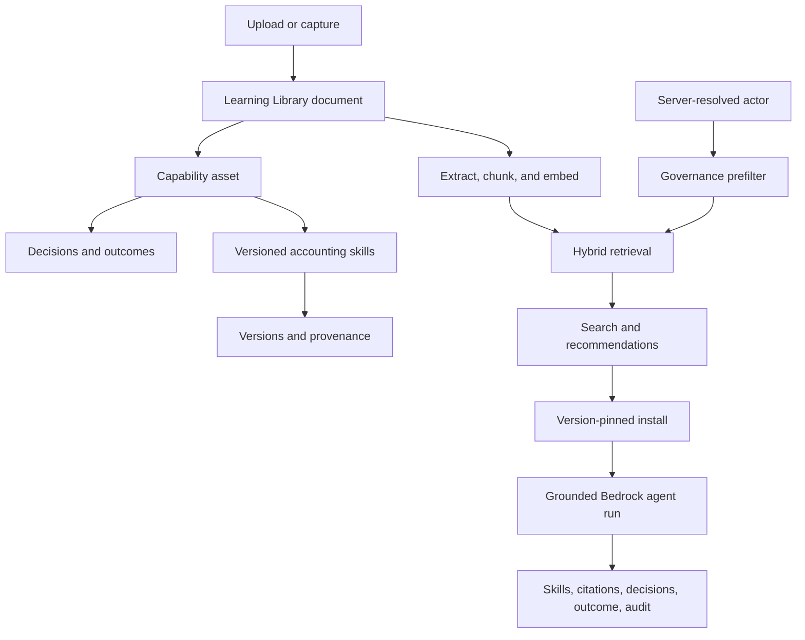

# Hackathon Memory

Organizational AI Memory built as a governed capability layer on top of the Hackathon Framework Learning Library.

The Learning Library remains the evidence substrate for uploads, extraction, OCR, summaries, chunks, embeddings, hybrid retrieval, citations, conversations, and retrieval traces. Organizational Memory adds reusable capability assets composed from versioned skills, provenance, stewardship, decisions, outcomes, recommendations, installations, grounded agent runs, and audit events.

## Killer moment

In a fictional departure scenario, CFO Magdalene Choong leaves and Partner Laura Nguyen inherits the Weekly Accounts Payable Run. Laura searches `weekly AP run`, finds the capability with Magdalene's authorship intact, and executes its five skills on day one. The agent cites the Learning Library, pays the approved batch once, records the ending balance, and persists the decision trace.

## Product surfaces

The original framework navigation is preserved:

- Home
- Query
- Results
- Library

An HR divider marks the start of the hackathon customization:

- Capabilities
- Recommendations
- Skills

## Architecture



Canonical content tables are `knowledge_documents`, `document_chunks`, `library_folders`, and `ingestion_events`. The `capability_*` tables add organizational meaning without introducing a parallel document or embedding system.

See [docs/architecture.md](docs/architecture.md), [docs/demo-script.md](docs/demo-script.md), and [docs/eval-gates.md](docs/eval-gates.md).

## Stack

- Angular 21 standalone frontend
- Express API packaged for Vercel Functions
- Neon PostgreSQL with pgvector for the live Vercel application
- Dockerized PostgreSQL 17 with pgvector for local development
- Dependency-free 1,024-dimension feature-hash embeddings for the deterministic path
- Grounded Bedrock query analysis and run-receipt generation, with a cited deterministic fallback

## Local setup

Prerequisites: Node.js 22+, pnpm 9, and Docker.

```sh
pnpm install
pnpm setup:local
pnpm dev
```

`setup:local` creates the ignored local API environment file when needed, starts PostgreSQL on port 5435, runs migrations, and idempotently seeds the clean-room memory world.

- Web: `http://localhost:4200`
- API health: `http://localhost:3333/api/health`
- PostgreSQL: `localhost:5435`

Individual database commands:

```sh
pnpm db:up
pnpm db:migrate
pnpm db:seed:memory
pnpm test:memory
```

## Neon and Vercel

The live Vercel application uses Neon in the same pattern as the KFC hackathon application: the API keeps the standard `pg` pool, and Vercel supplies Neon's pooled PostgreSQL connection string through `DATABASE_URL`.

Create a Neon database in a region close to the Vercel function region (`sin1` by default), enable the `vector` extension through the checked-in migration, and configure these Vercel variables for Preview and Production:

| Variable | Value |
| --- | --- |
| `DATABASE_URL` | Neon pooled connection string |
| `PGSSLMODE` | `require` |
| `PG_POOL_MAX` | `5` |

Provision the live database from a trusted local shell or CI environment with the Neon `DATABASE_URL` temporarily loaded:

```sh
pnpm db:migrate
pnpm db:seed:memory
```

Migrations and seeding are intentionally not executed during a Vercel build or request startup. The local Docker connection remains isolated in the ignored `apps/api/.env` file.

## Memory API

Every route is workspace-scoped with `x-workspace-id`. Memory routes also resolve an allowlisted demo identity from `x-demo-actor-id`; role, team, status, and clearance are always loaded server-side.

| Method | Route | Purpose |
| --- | --- | --- |
| `GET` | `/api/memory/actors` | Allowlisted demo actors |
| `GET` | `/api/memory/summary` | Capability and reuse counts |
| `GET` | `/api/memory/assets` | Accessible capability catalog |
| `POST` | `/api/memory/assets` | Capture and index a capability |
| `GET` | `/api/memory/assets/:assetKey` | Governed detail, evidence, and provenance |
| `POST` | `/api/memory/search` | Permission-first hybrid capability search |
| `POST` | `/api/memory/recommendations` | Task-oriented capability recommendations |
| `POST` | `/api/memory/assets/:assetKey/install` | Idempotent version-pinned installation |
| `POST` | `/api/memory/assets/:assetKey/runs` | Grounded multi-skill agent execution |
| `GET` | `/api/memory/runs/:runId` | Governed persisted run detail |
| `GET` | `/api/memory/departure-scenario` | Magdalene-to-Laura continuity proof |

The base Learning Library, document, conversation, and query routes remain available under `/api`.

## Clean-room boundary

The demo uses public GenAI Fund team names and official titles from its team page. The property-management employer, departure event, team assignments, accounting records, capability, evidence, decisions, and runs are fictional clean-room data and do not describe real events. The repository must not ingest private Roamstay code, customer content, credentials, or production data.

## GitHub destination

- Repository: `https://github.com/nycodez/hackathon-memory`
- Upstream framework: `https://github.com/nycodez/hackathon-framework`

The local repository is configured with the new destination as `origin` and the reusable framework as `upstream`.

## Production hardening

The demo actor resolver is intentionally limited to a scenario allowlist. Before accepting real users, add verified authentication, derive workspace membership from the authenticated principal, connect accounting skills to approved provider integrations, require human approval for real payments, add durable background ingestion, enforce quotas and malware scanning, and move large raw uploads to object storage.
