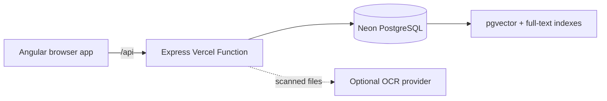

# Hackathon Framework

A clean Angular + Express starter for document-grounded hackathon products. It deploys as one Vercel project and uses PostgreSQL 17 with pgvector as the durable source of truth.

## Included

- Angular 21 standalone frontend with a product-style left navigation: Dashboard, Tasks, Skills, and Calendar
- Chat-style Query page with a bottom composer and source citations
- Read-only Decision Console with persisted, observable retrieval and response-policy events
- Durable, resumable conversation sessions on the Results page
- Nested Library folders with breadcrumb navigation and folder-aware uploads
- Type-aware, full-screen previews for PDF, image, Markdown, and text files
- Workspace task memory with 30 atomic office/accounting skills and ordered reusable task bundles
- Searchable organizational memory for prompts, workflows, governed agent patterns, decisions, and best practices
- Role-aware, immutable capability versions with provenance, stewardship, recommendations, and growth/gap analytics
- One seeded, runnable Weekly AP Run continuity scenario with ordered accounting skills, citations, decisions, audit history, and duplicate-payment protection
- One-time and recurring task schedules with a six-week calendar view
- Small-file upload with visible ingestion, OCR, summarization, chunking, and vectorization states
- Express API packaged as a Vercel Function under `/api`
- PostgreSQL migrations with workspace scoping, full-text search, `vector(1024)`, and HNSW indexing
- Dependency-free feature-hash embeddings, so retrieval works before an external embedding provider is added
- Bedrock OCR for scanned PDFs and images

## Architecture



The starter deliberately keeps the first deployment small:

- Raw files up to 4 MB are stored in PostgreSQL `bytea`, which stays under Vercel's request-body ceiling and avoids adding object storage to the baseline.
- Text, Markdown, CSV, JSON, HTML, and text-bearing PDFs process without an AI key.
- Scanned PDFs and images move to `needs_ocr` until Bedrock credentials and an OCR-capable model are configured.
- Summaries are deterministic and embeddings use local feature hashing. Replace these services with challenge-specific models without changing the database or API contracts.

For each query, the configured lightweight Bedrock model creates a structured retrieval plan. The API uses that plan to retrieve ready workspace-scoped chunks, bounds and labels the full source passages, and sends that context with the user's question to the primary Bedrock model. No relevant chunks means no generation call.

For a production-sized corpus, move raw objects to S3 or Vercel Blob, upload directly with signed URLs, and keep only metadata, extracted text, chunks, and vectors in PostgreSQL.

## Local run

Prerequisites: Node.js 22+, pnpm 9, and Docker.

Install dependencies, create the local environment file, start pgvector PostgreSQL, and migrate it:

```sh
pnpm install
pnpm setup:local
pnpm dev
```

- Web: `http://localhost:4200`
- API health: `http://localhost:3333/api/health`
- PostgreSQL: `localhost:5433` (container port `5432`; host port `5433` avoids a common local PostgreSQL conflict)

Seed and evaluate the organizational-memory proof after migrating:

```sh
pnpm db:seed:memory
pnpm eval:memory
```

The seed is idempotent and explicitly presents departure/succession as a hypothetical demo scenario. The official product core is searchable reusable AI memory, context, governance, recommendations, and analytics. Governed AP execution is optional proof infrastructure that demonstrates the stronger continuity claim: the captured capability can still produce an outcome after its source owner leaves.

## Neon PostgreSQL

1. Create a Neon PostgreSQL project in or near the Vercel function region.
2. Run `pnpm db:migrate` with the Neon `DATABASE_URL`. The migration enables `vector`, `pgcrypto`, and `unaccent`.
3. Run `pnpm db:seed:memory` once for the idempotent demo scenario.
4. Keep `sslmode=require` in the connection string and store it only in Vercel environment variables.
5. Use Neon's pooled connection string for the serverless Vercel runtime.

The Vercel function is pinned to Singapore (`sin1`) by default. Choose a nearby Neon region or update `regions` in `vercel.json`.

## Vercel deployment

Import this repository as one Vercel project with the repository root as the project root. The checked-in configuration:

- installs the pnpm workspace;
- builds the Angular browser application;
- publishes `dist/web/browser`;
- deploys `api/[...path].ts` as the Express function;
- preserves `/api/*` while rewriting other application routes to Angular's `index.html`.

Set these environment variables for Preview and Production:

| Variable | Required | Purpose |
| --- | --- | --- |
| `DATABASE_URL` | Yes | Neon pooled PostgreSQL connection string |
| `PGSSLMODE` | Yes | Use `require` for Neon |
| `PG_POOL_MAX` | No | Per-function pool size; defaults to 5 |
| `MEMORY_BOOTSTRAP_TOKEN` | Deployment only | Protects the idempotent migration/seed bootstrap endpoint |
| `CORS_ORIGIN` | No | Only needed when the API is called from another origin |
| `LLM_PROVIDER` | Bedrock use | Set to `bedrock` |
| `AWS_REGION` | Bedrock use | Bedrock region; configured as `us-east-1` |
| `AWS_ACCESS_KEY_ID` | Vercel Bedrock use | IAM access key stored as a Vercel secret |
| `AWS_SECRET_ACCESS_KEY` | Vercel Bedrock use | IAM secret key stored as a Vercel secret |
| `AWS_SESSION_TOKEN` | Temporary credentials only | Session token for temporary AWS credentials |
| `BEDROCK_MODEL_ID` | Bedrock use | Primary Claude model or inference-profile ID |
| `BEDROCK_OCR_MODEL_ID` | No | OCR-capable Bedrock model; defaults to `BEDROCK_MODEL_ID` |
| `BEDROCK_CONTEXT_MAX_CHARS` | No | Maximum retrieved source text sent per query; defaults to 12,000 |
| `BEDROCK_LIGHTWEIGHT_MODEL_ID` | Bedrock use | Lightweight Claude model or inference-profile ID |
| `BEDROCK_EMBEDDING_MODEL_ID` | Bedrock use | Cohere embedding model ID |

Run migrations before opening the deployed application. Migrations are intentionally not executed during request startup or every Vercel build.

## API surface

| Method | Route | Purpose |
| --- | --- | --- |
| `GET` | `/api/health` | Database and vector contract health |
| `GET` | `/api/dashboard` | Workspace counts |
| `GET` | `/api/conversations` | Previous sessions |
| `GET` | `/api/conversations/:id` | Resume a session |
| `DELETE` | `/api/conversations/:id` | Delete a session and its messages |
| `POST` | `/api/query` | Search the corpus and store a grounded exchange |
| `GET` | `/api/library` | Current folder, breadcrumbs, child folders, and documents |
| `POST` | `/api/library/folders` | Create a folder in the current workspace location |
| `GET` | `/api/documents` | Corpus files and pipeline states |
| `POST` | `/api/documents` | Ingest one multipart file |
| `POST` | `/api/documents/:id/process` | Process or retry an ingested file |
| `DELETE` | `/api/documents/:id` | Remove a file and its chunks |
| `GET` | `/api/tasks` | List grouped atomic skills, templates, and memorized tasks |
| `POST` | `/api/tasks` | Memorize a named ordered bundle of skills |
| `PUT` | `/api/tasks/:id` | Update a memorized task and its ordered skills |
| `DELETE` | `/api/tasks/:id` | Remove a memorized task |
| `GET` | `/api/demo/actors` | List actors for the hypothetical continuity demo |
| `GET` | `/api/capabilities` | List governed capabilities for the selected actor |
| `GET` | `/api/capabilities/:id` | Read active version, ordered skills, provenance, steward, and permission |
| `POST` | `/api/capabilities/:id/install` | Install the active immutable version as a task |
| `POST` | `/api/capabilities/:id/runs` | Run governed skills as the `x-actor-id` actor with an idempotency key |
| `GET` | `/api/capabilities/:id/runs` | List persisted capability run history |
| `GET` | `/api/runs/:id` | Read one run, its decisions, citations, steps, and accounting outcome |
| `GET` | `/api/memory/search` | Search capabilities, tasks, skills, prompts, workflows, agents, decisions, and best practices |
| `GET` | `/api/memory/recommendations` | Surface proven prior work relevant to supplied context |
| `GET` | `/api/memory/analytics` | Show capability growth, duplication, and missing capability signals |
| `POST` | `/api/admin/memory-bootstrap` | Token-protected idempotent production migration and seed operation |
| `GET` | `/api/calendar` | List schedules and expanded occurrences for a bounded date window |
| `PUT` | `/api/tasks/:id/schedule` | Add or replace a task's one-time or recurring schedule |
| `DELETE` | `/api/calendar/schedules/:id` | Remove a task schedule |

Every data query is scoped with `x-workspace-id`; the frontend currently sends `hackathon-demo`. Replace this demo header with verified identity and authorization before accepting untrusted users.
Capability runs additionally require `x-actor-id`. Demo headers make authorization visible for the hackathon journey; they are not a substitute for production authentication.

## Where to customize

- Brand and navigation: `apps/web/src/app/layout/app-shell.component.ts`
- Visual system: `apps/web/src/styles.css`
- Query/retrieval orchestration: `apps/api/src/services/chat_service.ts`
- Bedrock grounded generation: `apps/api/src/services/bedrock_llm_service.ts`
- Embeddings: `apps/api/src/services/vector_service.ts`
- Extraction and OCR: `apps/api/src/services/ingestion_service.ts`
- Database schema: `apps/api/src/db/migrations.ts`

## Production hardening checklist

- Add authentication and derive `workspace_id` from the authenticated principal, not a browser-controlled header.
- Move large raw uploads to object storage with signed upload URLs.
- Add a durable queue for long-running OCR and indexing jobs.
- Add malware scanning, MIME signature validation, rate limits, and per-workspace quotas.
- Replace deterministic answer assembly with a grounded model call and preserve citations.
- Add automated migration, API, retrieval, and browser tests before public use.
